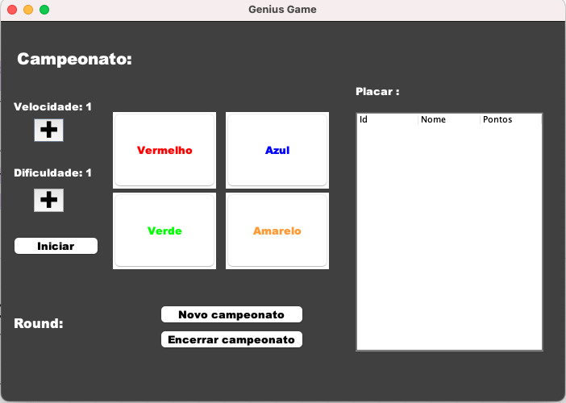
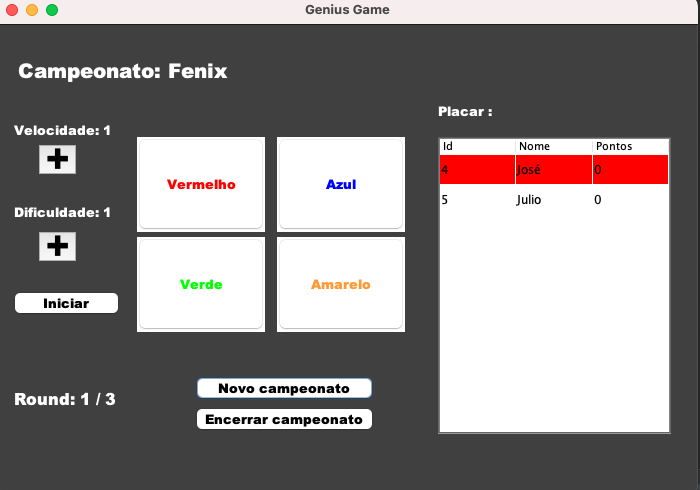
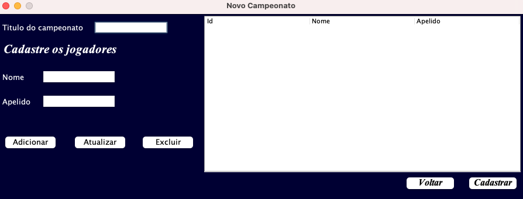
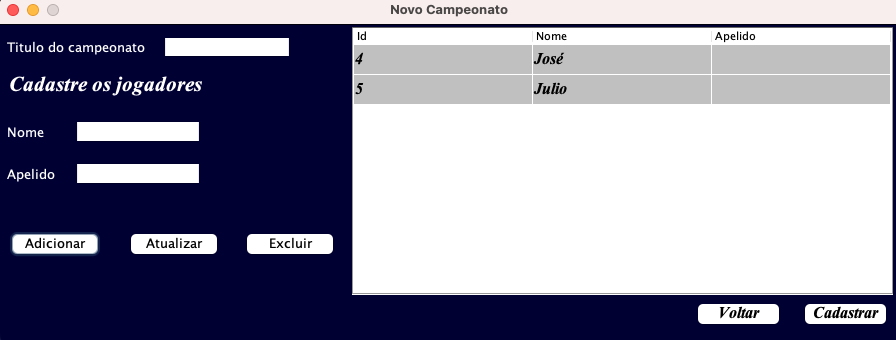

# Genius-Game
## Tela principal
 
 

## Tela de cadastro de torneio
 
 

## Informações importantes

- A quantidade de cores que acendem são a soma dificuldade e do round
- Para iniciar a jogada do jogador da vez é necessário apertar o botão Iniciar
- O jogo só pode ser jogado se em um torneio
- A linha vermelha na tabela da tela principal indica de que jogador é a vez
